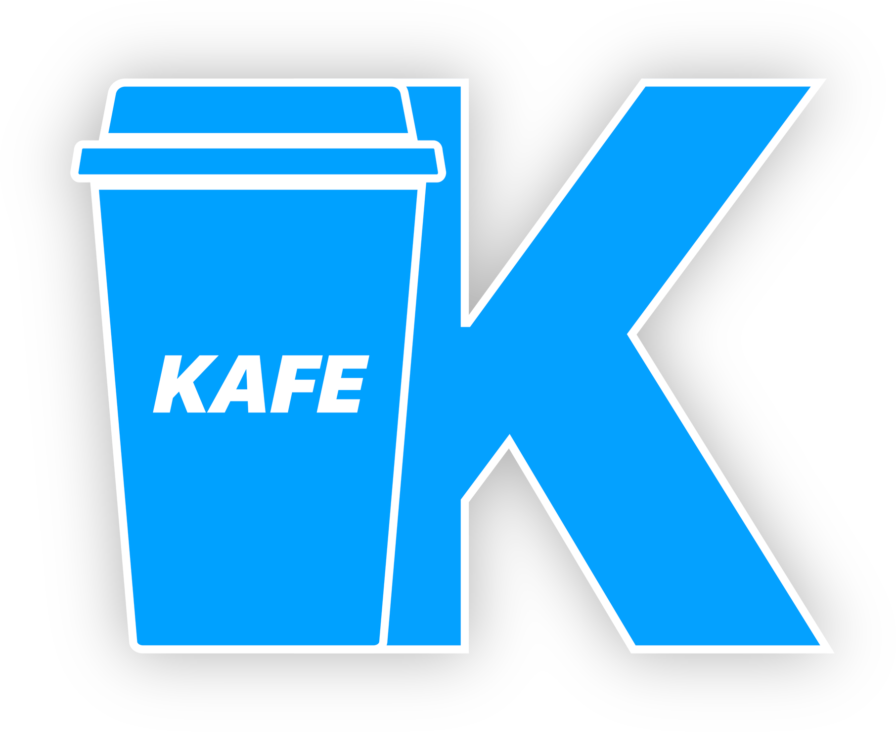

# Kafe lang



# Goal

This language is aiming video games, and was created to replace Lua, which lacks proper classes and convenient arrays.

# Example code

```
cls Player
    # constructor, must be unique
    Player(x: int, y: int, name: string)
        m_x = x
        m_y = y
        m_name = name
    end

    fun getName() -> string
        ret m_name
    end

    fun sayHi(other: Player) -> string
        ret format("%s says hi to %s", m_name, other.getName())
    end

    # all the variables in a class are automatically private
    m_x: int
    m_y: int
    m_name: string
end  // terminator is mandatory for classes

fun main() -> int
    superFola: Player = new Player(0, 0, "SuperFola")
    someone: Player = new Player(10, 5, "Someone")

    superFola.sayHi(someone)

    ret 0
end
```

# Building

Requirements:
* C++17 compiler
* CMake >= 3.8

```bash
kafe-master/$ cmake -H. -Bbuild
kafe-master/$ cmake --build build
```

A test program is generated under `build/tests/KafeTests`, and a `libKafe` is generated under `build/kafe`.

To use Kafe in a project, please refer to the [documentation](documentation/embedding/main.md)

# Credits

The logo: Tartiflemme, [Twitter](https://twitter.com/tartiflemme)

# Third-party libraries used

`termcolor`, released under BSD license, (c) 2013 Ihor Kalnytskyi